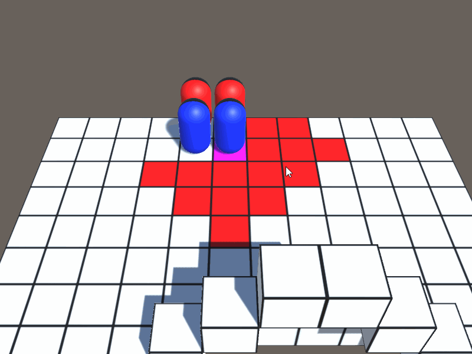
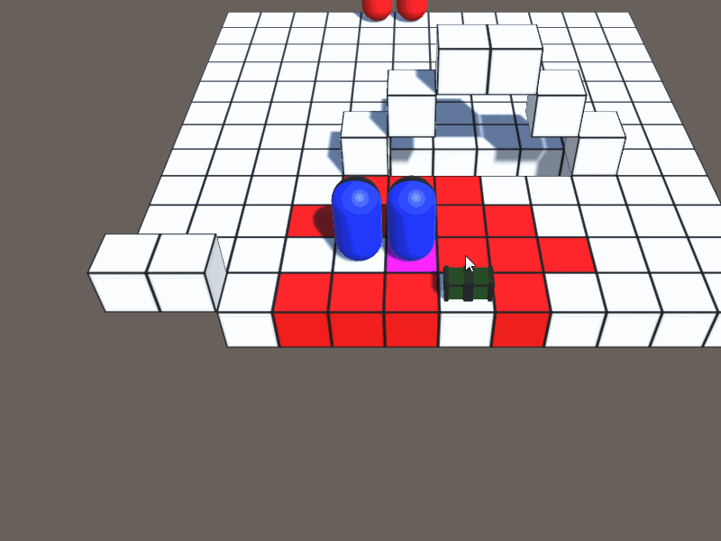
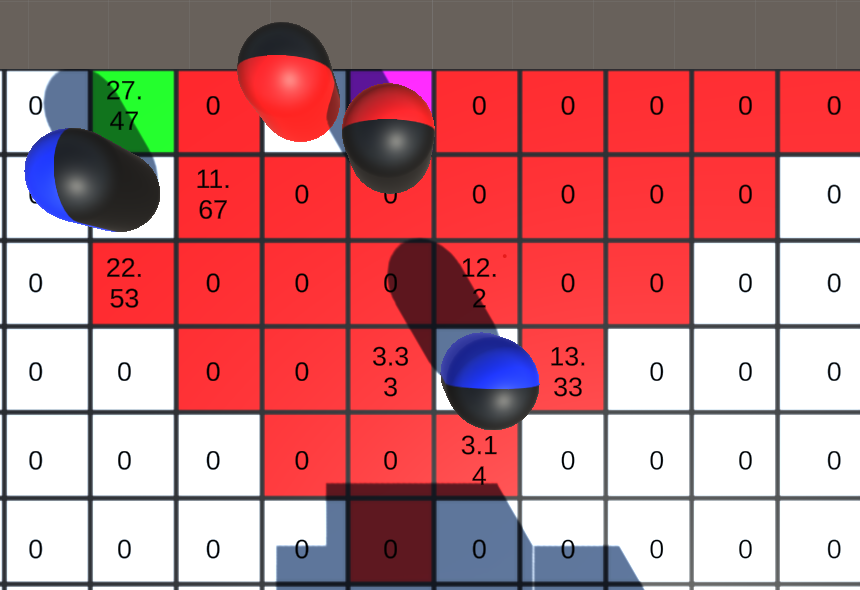
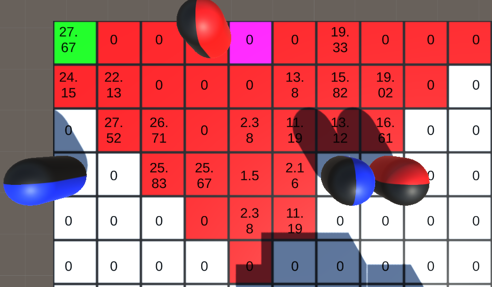

# Turn_Based_Strategy

## Overview
This repo contains a working prototype for a turn based strategy game in unity. 

## Controls

### Camera Controls
The player has full control over the camera through the use of the mouse or keyboard.

### Movement
Movement range of units are determined through BFS and are displayed in red on the board when it is the unit's turn. A tile can then be selected to move to and the path to the tile is calculated using A*. The number of tiles the unit can move is primarily determined by the class of the unit (can be assigned in the unity inspector).

Note: First unit is a mage and second unit is a thief.

Units also have the ability to interact with certain objects as part of their actions. Ex. A chest can be interacted with once to obtain the contained item, but it will not allow the unit to perform any additional actions.  
  

### Combat
Units can attack in a range determined by the weapon they have equipped. Upon engaging in combat camera controls are disabled and a combat camera is engaged. Health bars can be seen when mousing over a unit and during combat.

**Damage Calculation**  
Several systems are in place for damage calculation. (Look at DamageCalculator.cs for full formulas for damage calculation)
* Crit: Mutiplier is always 1.5x, gained from weapons/armor
* Dodge: Gained from armor and dex (has diminishing returns)
* Defense: Gained from armor and str
* Magic Defense: Gained from armor and int  

Weapons have a weapon scaling property which can be strength, dexterity or intelligence. Damage dealt is increased by a portion of the unit's points in that stat.
Additionally, damage from attacks can be either physical or magical and are reduced by the respective type of defense.  

Damage dealt is also scaled by the side the unit is hit from. Damage from the front of the defender is reduced by 50%, side 25% and back deals full damage.

### Abilities
Classes have abilities that can be accessed from the ability menu. Using an ability ends the unit's turn, performs the specified action and puts the ability on cooldown for a set number of turns.  
  

### Other
Units on the team and actions of the currently selected unit can be cycled through using the buttons on screen.

## AI
AI of enemy units assigns a score to each tile it can currently move to. If units are in range of attack, only tiles in which an enemy can be attacked are given scores. If there are no units in range, then AI attempts to close the distance to the enemy.  

The score considers factors including, distance from enemies (closer tiles are considered more dangerous and have a lower score), whether the attack will kill the enemy unit and the amount of damage that can be dealt to enemies from the tile (considers full damage calculation, including the side unit is attacking from as well as the defensive stats of the enemy).  

Scores for distance from enemy units are determined by finding the maximum and minimum distance from the enemies possible from destination tiles. These distance values are then normalized and multiplied by a constant value (the weight/value given to maximizing distance between this unit and the opposing team's units). (Detailed calculations can be viewed in TacticsAI.cs)  
  
**Melee example explanation:**  
Scores assigned to each tile are displayed for the attacking AI unit (the right red and black pill). The optimal tile for the current AI settings is shown in green. The blue pill on the bottom right of the image has significantly better armor in this example. Thus, the attacker has chosen a tile from which it can attack the other enemy. Additionally, tiles on the sides of the enemy have greater scores assigned to them because of the damage reduction from attacking from the front (the black side of the pill). Finally, the AI has chosen the top location rather than the bottom in order to maximize distance from the other enemy.  

  
**Ranged example explanation:**   
Scores assigned to each tile are displayed for the attacking AI unit (the red and black pill at the top of the image).The optimal tile for the current AI settings is shown in green. In this example, the blue pill in the bottom right of the image has significantly better armor than the pill on the left. Therefore, the attacker has chosen to target the pill on the left. Since the weapon used by the attacker has a range of 3 tiles, all tiles that the unit can move to and attack an enemy unit are given a score. The tile the AI has chosen causes an attack to the front of the enemy (the black side of the pill) and will therefore do significantly reduced damage, however this tile was chosen due to the distance from the other enemy unit.

## Save/Load
The state of the game is able to be saved using the pause menu preserving unit positions, ability cooldowns, unit stats including health and damage received and which units have used their turn.  
  
Note: The player can not save on the opponent's turn
